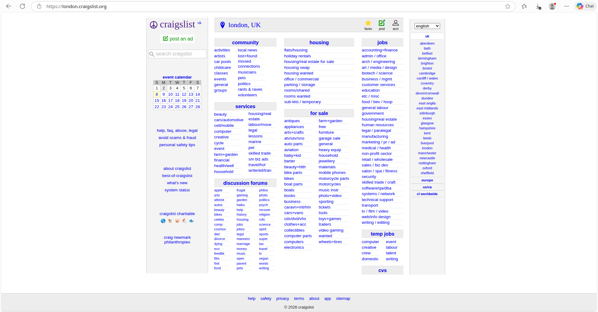
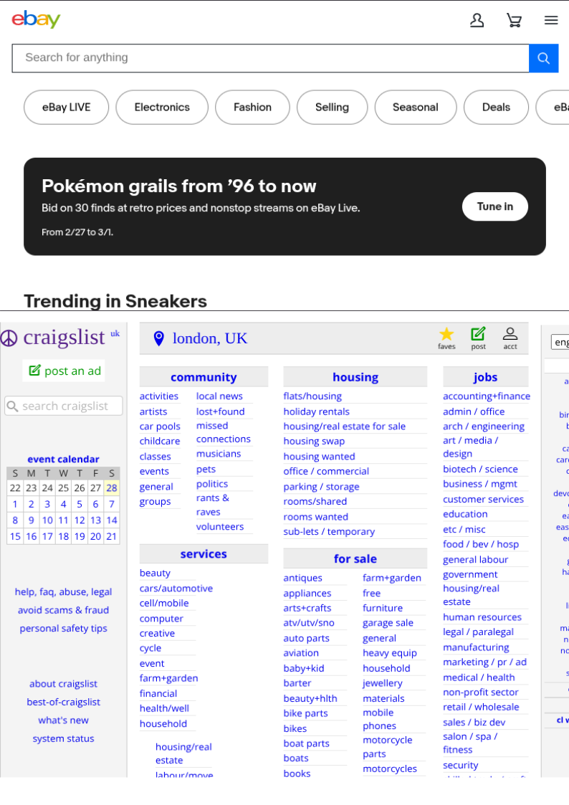
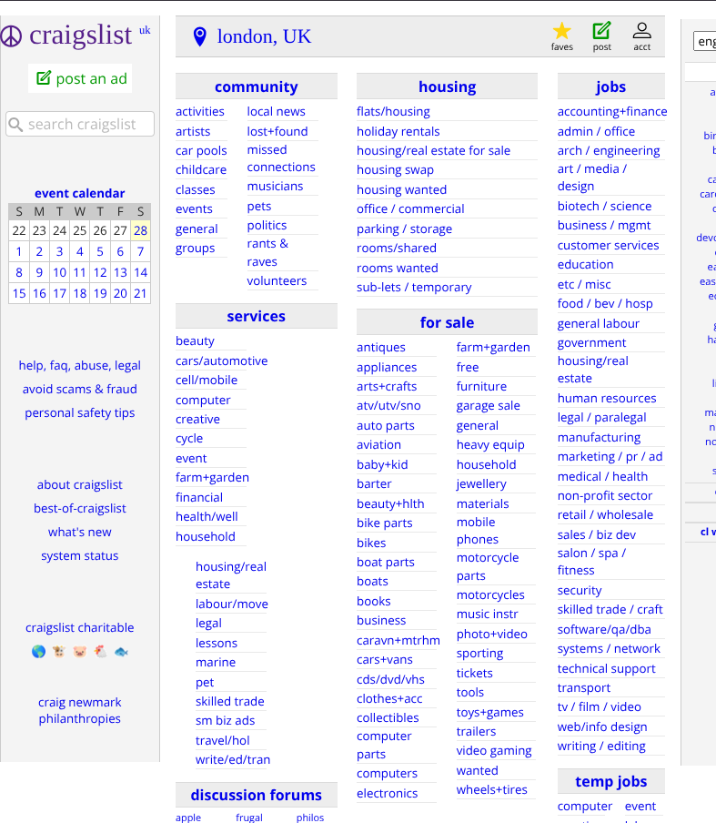
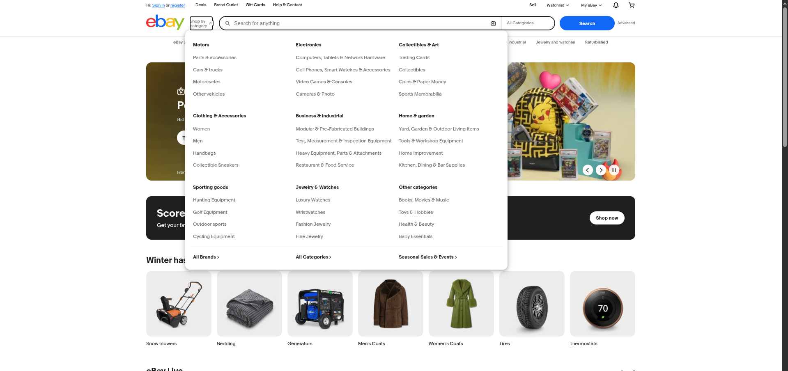
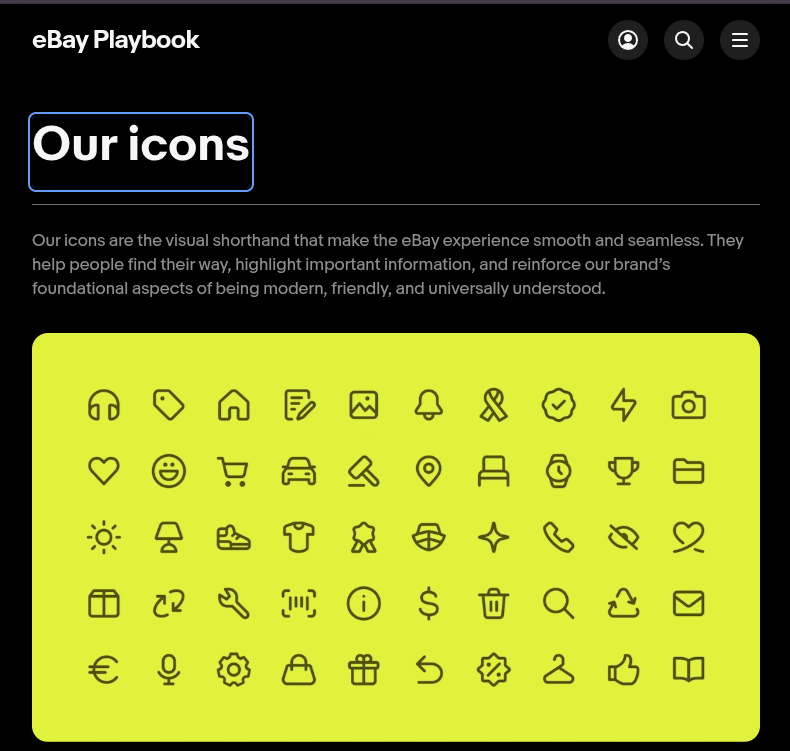
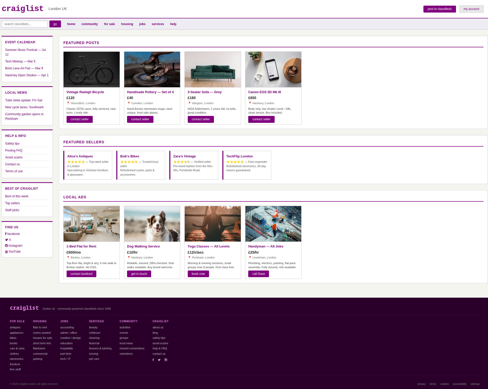
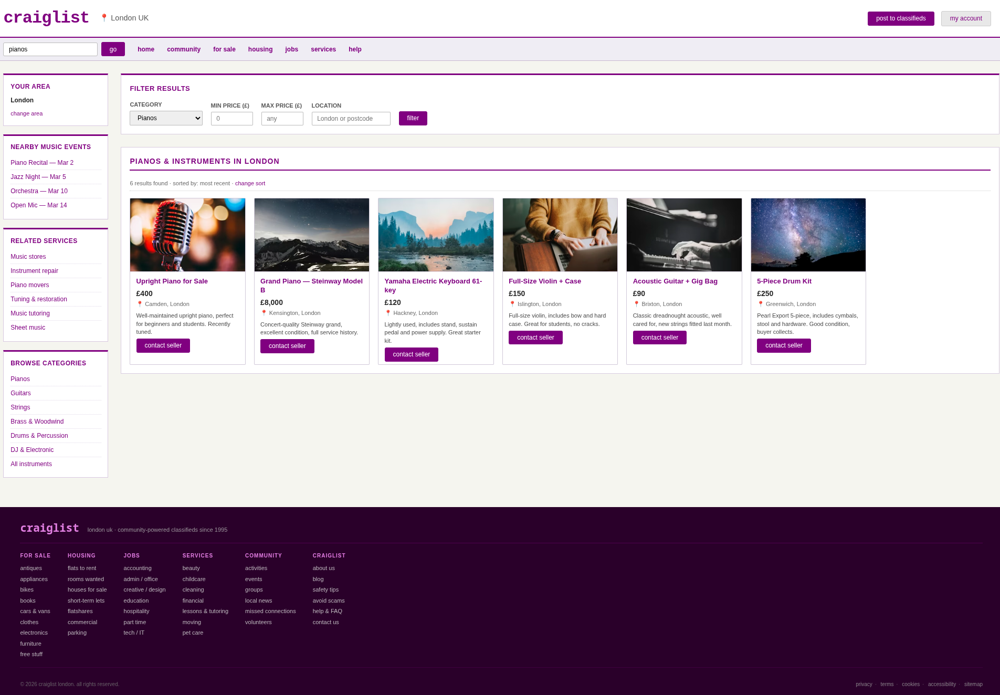
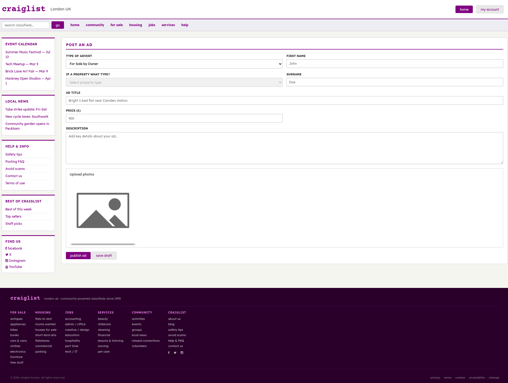
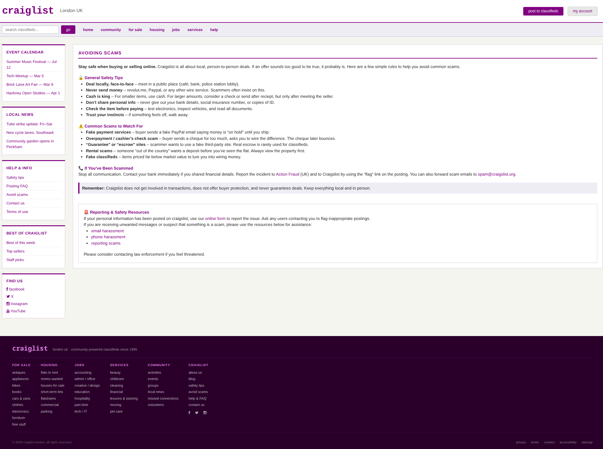
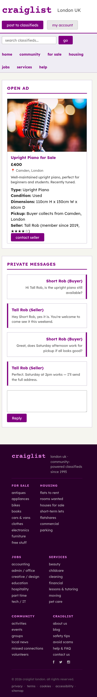

# DUX_A1_A2_CL
# DUX A1_GROUP
# Craigslist UK Redesign Project

## Table of Contents

1. [Aims and Justification for Website Development](#1-aims-and-justification-for-website-development)
2. [Target Audience, User Personas, User Stories, Tasks and Acceptance Criteria](#2-target-audience-user-personas-user-stories-tasks-and-acceptance-criteria)
3. [Design — Wireframes, Accessibility & Usability](#3-design--wireframes-accessibility--usability)
4. [Reflection on the Design Process](#4-reflection-on-the-design-process)
5. [Contributors](#5-contributors)
6. [References](#6-references)

---

## 1. Aims and Justification for Website Development

### Overview

Craigslist is a community-driven classifieds platform used for buying, selling, trading, and requesting or offering services at a local level. It handles listings for everyday items such as furniture, electronics, and odd jobs. Despite its wide reach, the current Craigslist UK website (london.craigslist.org) presents significant usability and accessibility deficiencies that hinder engagement and alienate large segments of the population.

The aim of this project is to investigate those deficiencies, justify the need for a redesigned website, and produce an improved design that addresses identified problems while remaining faithful to Craigslist's community-classifieds purpose.

To achieve this we will break it down into 3 parts: evaluation of business needs, and identified issues; Target Audience, User Personas, Stories ; Design Wireframes, Evaluate improved accessibility and usability

### Business Needs and Identified Issues

#### 1.1 Outdated Visual Design and Steep Learning Curve

The current Craigslist interface relies entirely on text-based navigation with no visual hierarchy, icons, or graphical signposting. PhD researcher Nihal Nayak (Harvard University) characterised the site as "out-of-fashion" with a steep learning curve (Nayak, 2019). Because so few modern websites use this style, new users must actively learn the interface rather than applying familiar web conventions — a direct violation of the usability principle of **consistency with external standards** (Nielsen, 1994).



> **Description:** Screenshot of london.craigslist.org homepage showing text-only layout, lack of sectional dividers, and absence of visual hierarchy.

#### 1.2 Non-Intuitive Search Functionality

The search box is positioned in the top-left corner beneath the page title. While visible, it contains no graphical button or icon to trigger a search. Users must know to press Enter/Return — an interaction pattern largely abandoned by modern web services. Competitor platforms eBay UK and Gumtree both use clearly labelled, graphically styled search buttons that align with established user expectations.



> **Description:** Side-by-side comparison of Craigslist's search bar (no button) vs. eBay UK (prominent search buttons).

#### 1.3 Lack of Mobile Responsiveness

Craigslist does not implement responsive design patterns such as dropdown menus, collapsible navigation, or touch-optimised tap targets. A substantial and growing proportion of web traffic originates from mobile devices, particularly among younger demographics who prefer a mobile-first experience. The absence of responsive design means content overflows on small screens, elements fail to scale correctly even when browser zoom is applied, and touch targets are too small for reliable interaction.



> **Description:** Annotated screenshot of Craigslist rendered on a mobile viewport, illustrating layout overflow and unscaled text elements.

#### 1.4 Poor Accessibility

The site uses inconsistent semantic landmark regions, provides minimal colour contrast differentiation between content areas, and offers no ARIA attributes or skip-navigation links. This makes the site difficult or impossible to use for people relying on screen readers, keyboard navigation, or assistive technologies — a failure to meet WCAG 2.1 Level AA standards (W3C, 2018).

The sites semantic landmark region has no delineation between the topmost row, that selects the region, category, allows access to post creation and account information, and the search functions this means every time a screen reader or braille device goes over the header section they read both navigation information and site controls (region, category, post creation, and account information), instead of what should happen where navigation, search, and main are in three identifiable sections for those tools.

#### 1.5 Competitive Analysis Summary

| Feature                    | Craigslist UK | eBay UK | Gumtree |
|----------------------------|---------------|---------|---------|
| Graphical search button    | ✗             | ✓       | ✓       |
| Category icons             | ✗             | ✓       | ✓       |
| Mobile responsive layout   | ✗             | ✓       | ✓       |
| Visual section separation  | ✗             | ✓       | ✓       |
| Accessible colour contrast | ✗             | ✓       | Partial |
| Dropdown / hamburger menus | ✗             | ✓       | ✓       |



> **Description:** Screenshot of eBay UK homepage showing icons, responsive grid layout, and popup navigation menus.

#### 1.6 Analysis of eBay Iconography

eBay hosts their own dedicated design documentation site called the **eBay Playbook**, which is dedicated to showcasing how they as a business function and deliver their level of service.

The site has a whole page dedicated to eBay's iconography and their own icon library. This library includes purpose-built icons covering the majority of their product categories — headphones for electronics, a car for automotive, footwear, a t-shirt for clothing, a lamp shade for home furnishings, a bed frame for furniture, boats for leisure, and many more.

Unlike craigslist these icons are synonymous to the user have alternative text for screen-readers and are used across ebay apps, sites, pages, and services, and they are considered by ebay to be a **foundation** of their design. These icons and more can be found at [playbook.ebay.com/foundations/iconography/our-icons](https://playbook.ebay.com/foundations/iconography/our-icons)



> **Description:** Screenshot of ebay UK Playbook page on iconography, demonstrating eBay's structured icon library used across their platform for intuitive category navigation.

### Justification for Development

The evidence above demonstrates a clear and urgent business need for website redevelopment. The purpose behind the redesign is to:

* Reduce the learning curve for first-time and infrequent visitors by aligning with contemporary web design conventions.
* Improve accessibility to meet WCAG 2.1 Level AA standards, enabling use by people with disabilities.
* Introduce mobile-responsive layouts to capture and retain traffic from mobile users.
* Implement intuitive graphical navigation and prominent search functionality to reduce abandonment and improve conversion rates.
* Maintain Craigslist's community-classifieds identity while making it competitive against modern alternatives.

---

## 2. Target Audience, User Personas, User Stories, Tasks and Acceptance Criteria

### Target Audience

Craigslist UK serves a broad community of users across the UK who wish to buy, sell, trade, or seek/offer local services. Key audience segments include:

* **First-time visitors** exploring online classifieds for the first time or new to Craigslist specifically.
* **Returning visitors** who use the site periodically for specific needs (e.g., selling items every few months).
* **Frequent visitors** who rely on the platform regularly for business or personal activity.
* Additional segments include buyers, sellers, landlords, jobseekers, and community members posting local events.

---

### Persona 1 — Sarah (First-Time Visitor)

| Attribute               | Detail                                                                                                                                   |
|-------------------------|------------------------------------------------------------------------------------------------------------------------------------------|
| **Age**                 | 40                                                                                                                                       |
| **Occupation**          | Carer                                                                                                                                    |
| **Location**            | Hertfordshire                                                                                                                            |
| **Devices**             | iPhone (primary), Windows laptop                                                                                                         |
| **Tech comfort**        | Comfortable with basic web navigation; prefers graphical interfaces                                                                      |
| **Accessibility needs** | Dyslexia (uses screen reader / text-to-speech); occasional hand tremors (requires large touch targets); relies on voice search on mobile |

**Background:** Sarah has never used Craigslist before and is exploring online classifieds to source affordable second-hand furniture for a client. She is tech-savvy but prefers clear, visually structured layouts over text-heavy pages. She finds Craigslist's current interface overwhelming and has encountered issues with elements not scaling correctly when browser zoom is applied.

#### User Stories — Sarah

| #  | User Story                                                                                                                                                                                      |
|----|-------------------------------------------------------------------------------------------------------------------------------------------------------------------------------------------------|
| S1 | As a **first-time visitor**, I want to **search for second-hand furniture using a visible search button**, so that **I can find relevant listings without needing to know keyboard shortcuts**. |
| S2 | As a **user with dyslexia**, I want the **website to use clear, simple language with generous spacing and readable fonts**, so that **I can browse listings without cognitive overload**.       |
| S3 | As a **mobile user with hand tremors**, I want **large, clearly labelled buttons and touch targets**, so that **I can navigate the site reliably on my smartphone**.                            |

#### Tasks — Sarah

* Navigate to the homepage and locate the search bar.
* Enter a search term ("second-hand sofa") and initiate the search using an on-screen button (without pressing Enter).
* Filter results by location (Hertfordshire) and price range.
* Open a listing and view item details including images, price, description, and seller contact information.
* Use a screen reader or text-to-speech to access listing content.

#### Acceptance Criteria — Sarah

**S1 – Search functionality:**

> *Given* Sarah is on the homepage, *when* she types "sofa" into the search bar and taps the graphical search button, *then* she should be presented with a list of relevant local listings within 3 seconds, without needing to press Enter.

**S2 – Readability:**

> *Given* Sarah opens a listing page, *when* she reads the listing description, *then* all text must use a sans-serif font of at least 16px, with a line-height of at least 1.5, and a minimum colour contrast ratio of 4.5:1 (WCAG 2.1 AA).

**S3 – Touch targets:**

> *Given* Sarah is using the site on her iPhone, *when* she attempts to tap any button, link, or interactive element, *then* all tap targets must be a minimum of 44×44 CSS pixels in size (WCAG 2.1 Success Criterion 2.5.5).

---

### Persona 2 — Dexter (Returning Visitor)

| Attribute               | Detail                                                                                                                               |
|-------------------------|--------------------------------------------------------------------------------------------------------------------------------------|
| **Age**                 | 35                                                                                                                                   |
| **Occupation**          | Graphic Designer                                                                                                                     |
| **Location**            | London                                                                                                                               |
| **Devices**             | MacBook Pro (primary), Android tablet                                                                                                |
| **Tech comfort**        | High; experienced with web tools; critical of poor UI/UX                                                                             |
| **Accessibility needs** | Arthritis in hands (keyboard navigation preferred; difficulty with precise mouse control); deuteranopia (red-green colour blindness) |

**Background:** Dexter returns to Craigslist every few months to sell old electronics or look for items in familiar categories. He has browser extensions for magnification and high-contrast mode but wishes sites were accessible by default. He values auto-save on forms and struggles with small input fields. His design background means he quickly dismisses cluttered or outdated interfaces.

#### User Stories — Dexter

| #  | User Story                                                                                                                                                                                                                             |
|----|----------------------------------------------------------------------------------------------------------------------------------------------------------------------------------------------------------------------------------------|
| D1 | As a **returning visitor**, I want the **website to remember my preferred listing categories**, so that **I can get back to relevant content quickly without re-configuring my search each time**.                                     |
| D2 | As a **keyboard user**, I want to **navigate the entire site without a mouse**, so that **I can use the platform comfortably despite limited hand dexterity**.                                                                         |
| D3 | As a **user with deuteranopia**, I want **status indicators and important information to be conveyed through shape or text labels rather than colour alone**, so that **I do not miss critical information due to colour-coded cues**. |

#### Tasks — Dexter

* Log in to an existing account using keyboard navigation only (Tab, Enter, arrow keys).
* Navigate to the "Electronics" category using the keyboard and locate a previously posted listing.
* Create a new listing: enter title, description, price, and upload an image, with auto-save enabled.
* Review form validation messages that do not rely solely on red/green colour indicators.
* Submit the listing and receive a confirmation that is accessible via keyboard focus.

#### Acceptance Criteria — Dexter

**D1 – Returning user preferences:**

> *Given* Dexter has previously browsed the "Electronics" category, *when* he returns to the homepage, *then* the site should surface a "Recently Viewed" or "Your Categories" section that links back to Electronics without requiring a new search.

**D2 – Keyboard navigation:**

> *Given* Dexter is using keyboard-only navigation, *when* he tabs through the page, *then* every interactive element (links, buttons, inputs, dropdowns) must be reachable via Tab and operable via Enter/Space, with a clearly visible focus indicator at all times (WCAG 2.1 SC 2.4.7).

**D3 – Colour-independent information:**

> *Given* Dexter is viewing a form with validation errors, *when* an input fails validation, *then* the error must be communicated through a text label and/or icon — not through a colour change alone — ensuring it is perceivable to users with colour vision deficiencies (WCAG 2.1 SC 1.4.1).

---

### Persona 3 - Lana (Frequent Visitor)

| Attribute               | Detail                                                                                                                                                                    |
|-------------------------|---------------------------------------------------------------------------------------------------------------------------------------------------------------------------|
| **Age**                 | 22                                                                                                                                                                        |
| **Occupation**          | Student                                                                                                                                                                   |
| **Location**            | Hertfordshire                                                                                                                                                             |
| **Devices**             | Android (primary), Windows Desktop                                                                                                                                        |
| **Tech comfort**        | Comfortable with a range of digital tools; prefers structured interfaces with clear, simple navigation.                                                                   |
| **Accessibility needs** | ADHD (prefers clear, structured layouts with concise text); visual sensitivity (prefers soft contrast and minimal glare); relies on search filters and saved preferences. |

**Background:** Lana uses Craigslist weekly to search for part-time work and tutoring opportunities. She relies on structured, easy to navigate interfaces. She finds the text-heavy layout of Craigslist challenging to scan a prefers filtering tools to quickly narrow down her results

#### User Stories — Lana

| #  | User Story                                                                                                                                                                                   |
|----|----------------------------------------------------------------------------------------------------------------------------------------------------------------------------------------------|
| L1 | As a **frequent visitor**, I want to **filter my search results by category and location**, so that **I can quickly find relevant listing without being overwhelmed by irrelevant options**. |
| L2 | As a **user with ADHD**, I want the **website to have clear visual hierarchy and concise descriptions**, so that **I can focus on the most important information without distractions**.     |
| L3 | As a **user with visual sensitivity**, I want **the website to offer a dark mode or soft contrast option,**, so that **I can browse without experiencing discomfort**.                       |

#### Tasks — Lana

* Navigate to the homepage and locate the search bar, ensuring the search button is clearly visible and easy to tap on her smartphone.
* Enter a search term ("affordable bikes") and initiate the search by tapping the search button (without needing to use the keyboard).
* Apply filters to refine search results
* Open a listing and view item details such as price, description, seller information, and images, ensuring the content is well-structured with clear headings and sufficient spacing.

#### Acceptance Criteria — Lana

**L1 – Filtering by category and location:**

> *Given* Lana is on search results page, *when* she applies a filter for location and selects a category, *then* the page should refresh and show listings that match those filters.

**L2 – Structured content and accessibility:**

> *Given* Lana is on a listing page, *when* she uses a screen reader *then* all listing details must be properly structured with clear and accessible HTML markup, so she can easily access the content.

**L3 – Search results accuracy:**

> *Given* Lana has entered a search term into the search bar, *when* the search results are displayed, *then* the listings shown should match the search term and be sorted by relevance, location adn price.

---

## 3. Design — Wireframes, Accessibility & Usability

> *This section will be completed following the creation of wireframe designs. It should include:*
> 
> * *Wireframe images for at least 3 pages or page areas (desktop or mobile)*
> * *Annotations explaining specific design decisions with reference to WCAG 2.1, usability heuristics (e.g., Nielsen's 10 Usability Heuristics), and WAI-ARIA where applicable*
> * *Notes on how each design choice addresses the needs of the user personas above*

### 3.1 Design Principles Applied

The wireframes will be guided by the following standards and principles:

* **WCAG 2.1 Level AA** — minimum contrast ratios, keyboard navigability, focus indicators, text alternatives for non-text content, and no reliance on colour alone.
* **WAI-ARIA landmarks** — use of `<nav>`, `<main>`, `<aside>`, `<header>`, and `<footer>` semantic regions to support screen reader navigation.
* **Nielsen's Usability Heuristics** — particularly visibility of system status, consistency with external standards, error prevention, and recognition over recall.
* **Mobile-first responsive design** — layouts designed for small screens first and scaled up, with touch targets of at least 44×44px.

#### 3.1.1 Indepth Review of WCAG Design Principles Applied

The design follows several key principles from the Web Content Accessibilty Guidilenes, Focusing on making the interface percievable, operable and understandable. 
* Text Alternatives for non-text content where used, every social media logo/icon was backed with alt text and displayed text of what it was, the same with advert images, and other graphical content.
* Keyboard Accessibilty, Grid allignment was used where possible to ensure keyboard based navigation would perform amuicably well as well as using components such as `<buttons>`, `<input>`, and `<select>`, where possible and clearly labelled. 
* Colour is not used as the only method of conveying information. For example, the messaging interface differentiates buyer and seller messages using alignment and border styles in addition to colour.

#### 3.1.2 Indepth Review of Nielsen’s Usability Heuristics Applied

**Visibility of System Status**

Interactive elements such as buttons and form submissions provide clear visual feedback so users know when actions have been performed.

**Consistency and Standards**

The header, navigation bar, sidebar, and footer remain consistent across all pages. This helps users learn the layout once and reuse that knowledge throughout the site.

**Recognition Rather Than Recall**

Listings are displayed as cards containing images, titles, prices, and locations. This reduces cognitive load by allowing users to visually recognise items rather than remember search details.

**Error Prevention**

Form inputs such as advert type are controlled using dropdown `<select>` elements with predefined options. This reduces the likelihood of incorrect or inconsistent user input.

**Flexibility and Efficiency of Use**

The search bar is prominently placed on the homepage so both experienced users and new visitors can quickly begin searching for listings.
### 3.2 Page / Area 1 — Homepage



**Design Notes:**

* Prominent search bar with a clearly labelled graphical search button, addressing Sarah's need to initiate search without keyboard shortcuts.
* Category grid using icons alongside text labels, reducing reliance on pure text navigation.
* Sufficient spacing between interactive elements to support users with hand tremors or motor impairments.
* "Recently Viewed" section for returning users such as Dexter.

**Implementation Notes:**
The homepage layout is implemented using semantic HTML elements such as `<header>`, `<nav>`, `<main>`, `<aside>`, and `<footer>`. These elements improve accessibility and screen reader navigation by clearly defining the structure of the page.

For example, the main site navigation is implemented using the `<nav>` element:

```html
<nav>
  <form>
    <input type="search" placeholder="search classifieds...">
    <button type="submit" class="btn btn-primary">go</button>
  </form>
  <a href="index.html">home</a>
  <a href="#">community</a>
  <a href="ads.html">for sale</a>
</nav>
```

This structure provides a clearly labelled search field with a visible "go" button, supporting users who may not rely on keyboard shortcuts. The use of `type="search"` also improves accessibility and browser behaviour.

The featured listings and local ads are displayed using a card-based grid layout, which helps users quickly scan information such as title, price, location, and description. Each advertisement is structured consistently:

```html
<div class="ad-card">
  
  <div class="ad-card-title">Vintage Raleigh Bicycle</div>
  <div class="ad-card-price">£120</div>
  <div class="ad-card-location">📍 Shoreditch, London</div>
</div>
```

Including descriptive `alt` attributes ensures that users relying on screen readers can understand the content of images.

### 3.3 Page / Area 2 — Search Results Page



**Design Notes:**

* Filter panel accessible via keyboard with clearly labelled checkboxes and dropdowns.
* Results presented as cards with thumbnail images, title, price, and location — reducing cognitive load for users with dyslexia.
* Sorting and filtering controls do not rely on colour alone for active/inactive states.

### 3.4 Page / Area 3 — Post a Listing Form



**Design Notes:**

* Large input fields with visible labels (not placeholder-only labels, which disappear on focus).
* Auto-save functionality at defined intervals to prevent data loss for users with slower input speeds.

**Implementation Notes:** the Post a Listing Form layout like the homepage and search page but it mainly focused on gain information from the possible sellers with minimal distractions. Most changes are made in then `<main>` segment with additions to the CSS file while `<nav>`, `<header>`, `<aside>`, `<footer>` stayed the same.

For example, the listing type and property type follows the same format where you have limited options to select from to prevent wrong information from being inputted for the listing by the `<select>` only allows selection of the `<options>`.

```html
 <form class="post-ad-form" action="#">
          <div class="post-ad-grid">
            <div class="form-group ad-type-field">
              <label for="adType">Type of advert</label>
              <select id="adType" name="adType">
                <option value="for-sale-owner">For Sale by Owner</option>
                <option value="for-sale-dealer">For Sale by Dealer</option>
                <option value="housing-offered">Housing Offered</option>
                <option value="housing-wanted">Housing Wanted</option>
                <option value="job-offered">Job Offered</option>
                <option value="service-offered">Service Offered</option>
                <option value="community">Community</option>
                <option value="event-class">Event / Class</option>
              </select>
            </div>
```

Any input that is need user input is set to `type=text` for any manual inputs from the poster such as: firstname, surname , description ad title and price.
```html
  <div class="form-group first-name-field">
              <label for="firstName">First name</label>
              <input type="text" id="firstName" name="firstName" placeholder="John">
            </div>
```

The website already saves the inputted data so the `btn-secondary` is mostly for placebo effect and the `btn-primary` submits the ad with the `type=“submit”`.
```html
  <div class="post-ad-actions">
            <button type="submit" class="btn btn-primary">publish ad</button>
            <button type="button" class="btn btn-secondary">save draft</button>
          </div>
        </form>
      </div>
```

For the upload photo function there is a blank empty photo icon that makes it intuitive to interact with the image to upload the photo which had the `“file uploader”`.
```html
          <div class="photo-upload-row">
            <div class="photo-upload-title">Upload photos</div>
            <div class="profile-picture">
              <h1 class="upload-icon"><i class="fa fa-plus fa-2x" aria-hidden="true"></i></h1>
              <input class="file-uploader" type="file" accept="image/*">
            </div>
          </div>

```

CSS for the to make the input bars fit the section with the `grid` fuction by seeting the column's `midmax`.
```CSS
.ads-grid {
  display: grid;
  grid-template-columns: repeat(auto-fill, minmax(min(100%, 220px), 1fr));
  gap: 1rem;
}
```

CSS for the Upload background image which controls the size and `shadow` of the bottom of the image to prevent it from blending into the pages white base background.
```CSS
.profile-picture {
  opacity: 0.75;
  height: 250px;
  width: 250px;
  position: relative;
  overflow: hidden;

  /* default image */
  background: url('https://media.istockphoto.com/id/1324356458/vector/picture-icon-photo-frame-symbol-landscape-sign-photograph-gallery-logo-web-interface-and.jpg?s=612x612&w=0&k=20&c=ZmXO4mSgNDPzDRX-F8OKCfmMqqHpqMV6jiNi00Ye7rE=');

  background-position: center;
  background-repeat: no-repeat;
  background-size: cover;
  box-shadow: 0 8px 6px -6px black;
}
```

---

### 3.5 Page / Area 4 — Avoiding Scams



**Design Notes:**

* Single-page clarity so all scam-related guidance is presented in one continuous, easy-to-read page without forcing users to navigate away.
* Actionable steps for each tip, showing what to watch for, how to verify listings, and what to do if something seems suspicious.
* Readable layout organized with headings, bullet points, and icons for quick scanning and avoiding walls of text.
* Accessible interactions that are fully keyboard and screen reader friendly, with clearly labeled and focusable warnings and examples.
* Persistent guidance so important warnings about buyer safety are always shown no matter the reason someone clicked on the page.
* Seamless navigation that allows users to leave the page without multiple back clicks while keeping top bar, navbar, and sidebar consistent and functional.
* Mobile-first design with touch-friendly elements and responsive layout for usability on all screen sizes.

---

### 3.6 Page / Area 5 — Open Ad



**Design Notes:**

* The page is designed primarily for mobile so the advertisement information appears first ensuring users immediately see the item details before any messaging interactions
* The listing is presented as a single card containing the image, title, price, location and description. This structure makes it easy for the user to quickly understand what is being sold
* The Ad image scales to fit the screen width while maintaining aspect ratio, with alternative text to provide support for screen readers and improve accessibility for visually impaired users.
* The price and location are visually seperated from the description to make key information easily identifiable at a glance
* Messages from buyers and sellers use different styling and alignment so users can easily follow the conversation without relying solely on coulor differences
* The header, navigation bar, and footer remain consistent with the rest of the site, helping users maintain orientation and navigate between categories, listing and help resources without confusion
* Buttons, links and input fields are sized appropriately for mobile touch interactions to minimise accidental taps and improve usability on smaller screens

**Implementation Notes:**

The Open Ad page is implemented using semantic HTML to clearly separate the listing content, messaging system, and overall page structure. Elements such as `<header>`,` <nav>`, `<main>`, `<section>`, and `<footer>` are used to improve accessibility, assistive technology support, and logical document structure.

For example, the main Ad listing is displayed using a card-style layout. This groups the image, price, description, and seller information together.

```html
<div class="ad-card">
    

    <div class="ad-card-body">
        <div class="ad-card-title">Upright Piano for Sale</div>
        <div class="ad-card-price">£400</div>
        <div class="ad-card-location">📍 Camden, London</div>

        <div class="ad-card-desc">
            Well-maintained upright piano, perfect for beginners and students.
        </div>
    </div>
</div>
```

This card-based structure ensure the key information can be quickly scanned by buyers. The descriptive alt text for the image ensures the listing remains understandable for users relying on screen readers.

The private messaging system is implemented directly below the Ad using a threaded layout. Messages are contained inside a `.messages-thread` container which uses Flexbox to stack messages vertically

```html
<div class="messages-thread">
    <div class="seller-card message-buyer">
        <h5>Short Rob (Buyer)</h5>
        <p>Hi Tall Rob, is the upright piano still available?</p>
    </div>

    <div class="seller-card message-seller">
        <h5>Tall Rob (Seller)</h5>
        <p>Hey Short Rob, yes it is. You're welcome to come see it this weekend.</p>
    </div>
</div>
```

Each message is styled using the `.seller-card` class, which provides the base card styling including borders, padding and typography.
Buyers messages include an additional `.message-buyer` class, which modifies the layout to visually separate the response from the seller messages:
```css
.messages-thread .message-buyer {
border-left: 1px solid #d0c8d8;
border-right: 4px solid #800080;
text-align: right;
}

```

## 4. Reflection on the Design Process

### 4.1 Key Decisions, trade-offs and Successes

The redesign process started with use critically assessing the existing Craigslist UK site against modern design standards. This analysis identified some serious deficiencies which extended across the entire site, with few being isolated.

A central debate emerged amongst the team: how much could we get done for Craigslist and how much of the original minimalistic design could we keep.Its sparseness was part of its identity, but it also created a steep learning curve (Nayak, 2019). We resolved this by maintaining the existing text based buttons where possible, and selectables while also adding icons, this solved two issues for us maintaining that minimalistic approach, while also being adapted for screen readers there was no need to add alt text to our facebook icon as it was followed by facebook or our vehicles icon as it was also followed by the word Vehicles.

### 4.2 Accessibility as a Foundation

Accessibility was not an afterthought of our project unlike the original site, We mapped WCAG 21 Level AA success criteria to every one of our design decisions:

Each icon/symbol/text maintained acceptable levels of contrast (4.5:1), verified by a check using [webaim contrast checker](https://webaim.org/resources/contrastchecker/), we maintained keyboard navigation by utilising keyboard compatible elements and avoiding dynamic popups where possible.

Semantic Elements - Landmarks were added to key regions of the navigation and page structure to improve compatibility with assistive technologies. The redesign separates the page into clearly defined `<header>`, `<nav>`, `<main>`, `<aside>`, and `<footer>` sections so that screen readers can interpret the structure of the page correctly. This directly addresses one of the major accessibility problems identified in the original Craigslist site where navigation, search, and account controls were grouped together without clear separation.

By structuring the layout using semantic landmarks, users relying on screen readers or braille displays can skip between major areas of the page instead of being forced to read through the entire header each time they load a new page. This significantly improves efficiency and aligns the design with WCAG 2.1 guidelines relating to navigable page structure.

Another accessibility consideration was avoiding the use of colour alone to communicate important information. For example, validation errors in forms are supported with icons and descriptive text labels rather than simply changing the colour of an input field. This ensures that users with colour vision deficiencies such as deuteranopia are still able to understand when an error has occurred and how to correct it.

### 4.3 Team Collaboration and Workflow

The design process was collaborative between all three team members, with responsibilities shared across research, wireframes, and documentation. Initial analysis of the Craigslist interface was conducted collectively, with each team member identifying usability and accessibility issues through heuristic evaluation and comparison with competitor platforms such as eBay and Gumtree.

Once the key issues had been identified, the team began developing wireframes to address those problems while still maintaining Craigslist's core identity as a simple community classifieds platform. Feedback was exchanged throughout the process, allowing designs to be refined and improved iteratively.

Using a shared repository allowed the team to track contributions and maintain version control of the project documentation and design files. This also ensured transparency in individual contributions and made it easier to combine different sections of the assignment into a cohesive final report.

The shared repository was only instituted when necessary, prior to this a shared drive was used when forming the ideas, and analysing the competitors. It was the responsibility of Kai Young to transfer this over and thus is why other team members haven't collaborated within those sections on the logs. 

### 4.4 Overall Reflection

Overall, the redesign process demonstrated to us how, legacy platforms can benefit from modern usability practices and how very popular coners on the internet are still years behind in levels of design and usability especially when it comes to their accessibility. By introducing clearer visual hierarchy, improved navigation and a full interface redesign. We were able to transform Craigslist from a site only compatible with basic support features of accessibility tools like screen readers, braille etc., to one supported by loads of complex accessibility tools, but also for individuals with impairments that don't have accessibility devices our surface level website is more accessible with greater contrast etc.

Through this project the team gained a deeper understanding of the relationship between usability, accessibility, and user-centred design, and how these principles can be applied to improve real-world digital platforms.


## 5. Contributors

| Name         | Email               |
|--------------|---------------------|
| Kai Young    | ky25aaa@herts.ac.uk |
| Will Cooper  | wg25aac@herts.ac.uk |
| Daniel Zhang | dz25aaa@herts.ac.uk |


---

## 6. References

Nayak, N. (2019) *A UI/UX Critique of Craigslist*. Medium. Available at: https://medium.com/@nihalnayak/a-ui-ux-critique-of-craigslist-e3b235824479 (Accessed: 8 February 2026).

Nielsen, J. (1994) '10 Usability Heuristics for User Interface Design', *Nielsen Norman Group*. Available at: https://www.nngroup.com/articles/ten-usability-heuristics/ (Accessed: 8 February 2026).

W3C (2018) *Web Content Accessibility Guidelines (WCAG) 2.1*. World Wide Web Consortium. Available at: https://www.w3.org/TR/WCAG21/ (Accessed: 8 February 2026).

'Craigslist: London, UK Jobs, Apartments, for Sale, Services, Community, and Events' (no date) *Craigslist*. Available at: https://london.craigslist.org/ (Accessed: 8 February 2026).

'eBay UK | Electronics, Cars, Fashion, Collectibles & More' (2024) *eBay UK*. Available at: https://www.ebay.co.uk/ (Accessed: 8 February 2026).

'Gumtree | Free Classified Ads from the #1 Classifieds Site in the UK' (no date) *Gumtree*. Available at: https://www.gumtree.com/ (Accessed: 8 February 2026).

Assignment 1 for DUX Kai, Will and Daniel - Remake of Craigslist UI (Craigslist London) to follow modern design principles, be accessible and open


# DUX_A2_CL_Kai_Young

## Table of Contents

1. [Design](#design)
2. [Development](#development)
3. [Testing](#testing)
4. [Version control](#version-control)
5. [Attribution](#attribution)
6. [Deployment & Run](#deployment--run)


## Design

- **Aim:** create an example implementation of the plan devsied in A1 above,
- **Objectives:** improve search discoverability (visible search button), add clear visual hierarchy and iconography, ensure responsive layouts and touch-friendly targets (>= 44×44 CSS px), and make pages keyboard + screen-reader-friendly.

### User stories (selected from Assignment 1)

- **Sarah (First-time visitor):** visible search button; readable typography (>=16px, line-height >=1.5); touch targets >=44×44.
- **Dexter (Returning visitor):** keyboard-only navigation; recently viewed/your categories; colour-independent status indicators.
- **Lana (Frequent visitor):** filterable search results by category/location; clear visual hierarchy; optional soft-contrast/dark mode.

### Revised wireframes and justification

- Files: [wireframes/Home.html](wireframes/Home.html), [wireframes/wireframe2.html](wireframes/wireframe2.html), [wireframes/wireframe3.html](wireframes/wireframe3.html)
- Changes and rationale:
  - Prominent search form with a labelled `button` (addresses Sarah S1).
  - Category grid with icons + labels to reduce reliance on text-only navigation (recognition over recall; helps Dexter & Lana).
  - Card-based results with thumbnail, title, price, location to improve scanability for users with dyslexia.
  - Semantic landmarks: `<header>`, `<nav>`, `<main>`, `<aside>`, `<footer>` to aid screen readers and support skip-navigation.
  - Form controls use visible labels (not placeholders), larger inputs, and clear ARIA attributes on dynamic controls.


## Development

- **Tech stack:** HTML5, CSS3 (Grid + Flexbox), responsive media queries, light PHP endpoints under `WEB_ROOT/api/` for demo data. Optional Font Awesome icons used for visual indicators (facebook, instagram, etc).
- **Pages implemented (minimum three):**
  - `https://dux-a2.kai-young.co.uk/?page=Home` — Homepage with search and category grid.
  - `https://dux-a2.kai-young.co.uk/?page=earch` — Search results and filters.
  - `https://dux-a2.kai-young.co.uk/?page=post_ad` — Post-ad form (functional form with file upload input).
  - `https://dux-a2.kai-young.co.uk/?page=open_ad` — Single ad view.
- **Responsive approach:** CSS Grid for results and layout; media queries for breakpoints (mobile-first). See `wireframe.css` and `WEB_ROOT/wireframe.css` for rules.
- **Accessibility features implemented:**
  - Semantic HTML landmarks (`<nav>`, `<main>`).
  - Visible focus indicators; keyboard-accessible controls (operable with Tab/Enter/Space).
  - `alt` attributes on images; labels on all form fields.
  - Contrast choices aligned to WCAG 2.1 AA targets where possible.
  - Errors show text + icon (not colour alone).
- **Interactive features:**
  - Search form submits to `https://dux-a2.kai-young.co.uk/?page=search` and demonstrates dynamic filtering.
  - Post-ad form uses client-side validation and a file input (users control uploads).
  - (Optional) the repository includes hooks to integrate a map API for location display — see comments in `https://dux-a2.kai-young.co.uk/?page=open_ad`.
- **Code quality & structure:**
  - HTML and CSS organized into clearly named directories: `WEB_ROOT/`, `WEB_ROOT/pages/`, `WEB_ROOT/api/`, `WEB_ROOT/files/`.
  - Consistent naming (lowercase, hyphens), commented CSS sections in `wireframe.css`.


## Testing

### Manual testing (user-story mapping)

- **S1 (Sarah — Search):** Type "washing machine" in homepage search, press on-screen Go button → results returned from `WEB_ROOT/api/search.php` within a reasonable time. Verified that pressing Enter and clicking button both work.
- **S2 (Sarah — Readability):** Open ad pages confirm body text is at least `14px` and `line-height: 1.5`. Contrast checked using an external contrast checker and documented in `testing/` screenshots.
- **S3 (Touch targets):** Interactive buttons and links evaluated on mobile viewport; all primary interactive targets sized >=44×44 px.
- **D2 (Dexter — Keyboard):** Tab through pages — navigation, filters, post-ad inputs reachable and operable with Enter/Space; visible focus ring present.
- **L1 (Lana — Filters):** Apply location and category filters on the search results page; results refresh and match filter criteria.

### Automated testing and validation

- **HTML/CSS Validation:** Run W3C HTML and CSS validators on deployed pages and include result screenshots in `testing/validators/`.
- **Performance & Accessibility Audit:** Run Google Lighthouse on the deployed site and include a summary (Performance, Accessibility, Best Practices, SEO) in `testing/lighthouse/`.

Notes: validation screenshots and Lighthouse reports are stored in `testing/` for inclusion in grading evidence.


## Version control

- **Git:** All development tracked with Git. The repository contains regular commits describing feature work (search, layout, accessibility fixes). Keep commit messages concise and meaningful (e.g. "add search form + server stub", "responsive grid for ads", "fix focus styles / aria labels").
- **Repository:** push to GitHub and enable branch protection if collaborating. Ensure at least several commits demonstrating progression before submission.


## Attribution

- **External libraries & resources:**
  - Font Awesome — icons (attributed in HTML comments where used).
  - Any third-party CSS snippets or examples are credited in comments above the relevant code blocks.
  - Design references: Nielsen Norman Group articles and W3C WCAG guidelines referenced in the README.

- **AI usage note:** Per module rules, any AI-assisted content generation used during development is documented separately. No AI-generated content is included in the final README or code submission for assessment.


## Deployment & Run

- **Local preview (PHP built-in server):** from the repository root run:

```bash
cd /home/kai/code/dux_A2_CL_Kai_Young
php -S localhost:8080 -t WEB_ROOT
```

- **Deployed site:** (add your GitHub Pages / Netlify link here)

- **Checklist before submitting GitHub link:**
  - All files present in repo and readable.
  - README includes design, development, testing evidence and deployment link.
  - External links configured to open in a new tab (`target="_blank" rel="noopener noreferrer"`).


---

If you'd like, I can now:
- run a quick pass to add W3C validation screenshots to `testing/` (if you want me to run Lighthouse we need a live URL or local host exposed), or
- prepare the GitHub README-ready screenshots and a short commit history summary for inclusion in the README.


## Table of Contents

1. [Craigslist UK Redesign Project with functionality](#1-Craigslist-UK-Redesign-Project-with-functionality)
2. [Revision of Wireframes](#2-Revision-of-Wireframes)
3. [Design — Wireframes, Accessibility & Usability](#3-design--wireframes-accessibility--usability)
4. [Reflection on the Design Process](#4-reflection-on-the-design-process)
5. [Contributor A2 Portion](#5-contributor)
6. [References](#6-references)


## 1. Craigslist UK Redesign Project with functionality 
To test this program please install php on your device and php server in vscode.
Go to vscode and open the folder "WEB_ROOT" as the project folder, click on index.php and click on the php button at the top or instead run command "php -S localhost:8080" from the same Working Directory

## 2. Revision of Wireframes 

